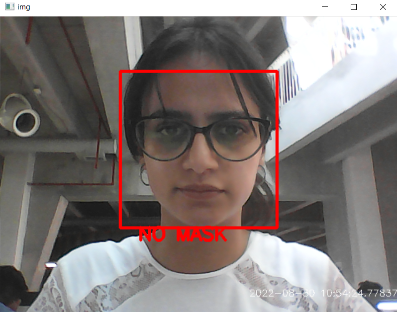

<h1 align="center">Face Mask Detection</h1>

  <h4>Face Mask Detection System built with OpenCV, Keras using Deep Learning and Computer Vision concepts in order to detect face masks in static images as well as in real-time video streams.</h4>

&nbsp;&nbsp;&nbsp;&nbsp;&nbsp;&nbsp;&nbsp;&nbsp;&nbsp;&nbsp;&nbsp;&nbsp;&nbsp;&nbsp;&nbsp;&nbsp;&nbsp;&nbsp;&nbsp;&nbsp;&nbsp;&nbsp;&nbsp;&nbsp;&nbsp;&nbsp;&nbsp;&nbsp;&nbsp;&nbsp;

## :innocent: Motivation
Amid the ongoing COVID-19 pandemic, there are no efficient face mask detection applications which are now in high demand for transportation means, densely populated areas, residential districts, large-scale manufacturers and other enterprises to ensure safety. The absence of large datasets of __‘with_mask’__ images has made this task cumbersome and challenging. 

## :warning: TechStack/framework used

- [OpenCV](https://opencv.org/)
- [Haar Cascade froontal face detector](https://docs.opencv.org/3.4/db/d28/tutorial_cascade_classifier.html)
- [Keras](https://keras.io/)
- [TensorFlow](https://www.tensorflow.org/)
<!-- - [MobileNetV2](https://arxiv.org/abs/1801.04381) -->

## About Project
This project uses a Deep Neural Network, more specifically a Convolutional Neural Network (CNN), to differentiate between images of people with and without masks. The CNN manages to get 
an accuracy of **96.8% on the test set**. Then the stored weights of the created model are used to classify as mask or no mask, in real time, using OpenCV.
With the webcam capturing the video, the frames are preprocessed and fed to the model to accomplish this task. The model works efficiently with no apparent lag time between
wearing/removing mask and display of prediction.

#### The model is capable of predicting multiple faces with or without masks at the same time

## Working 

### Without Mask

## Dataset

The data used can be downloaded through this [link](https://www.kaggle.com/datasets/aneerbanchakraborty/face-mask-detection-data)There are 1915 images with mask and 1918 images without mask comprosing a total of 3833 images.
